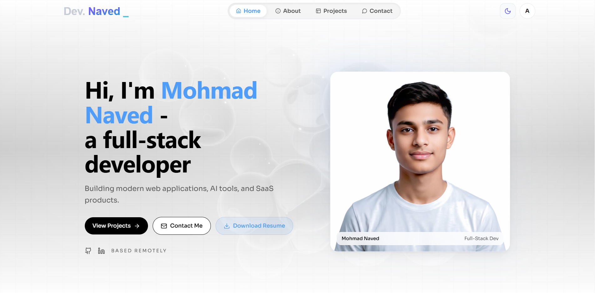
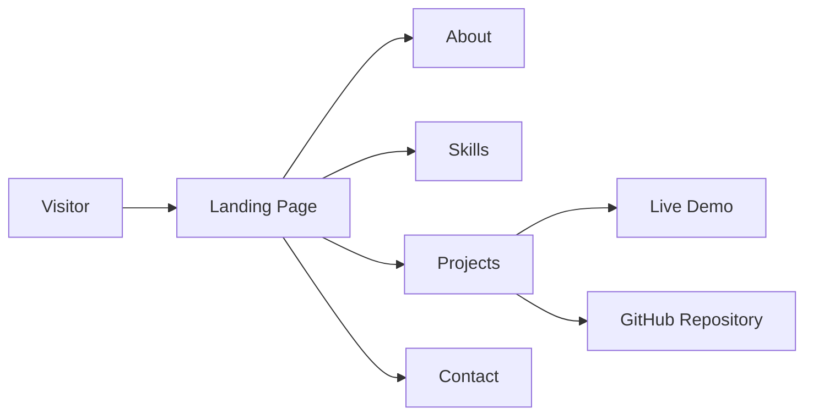
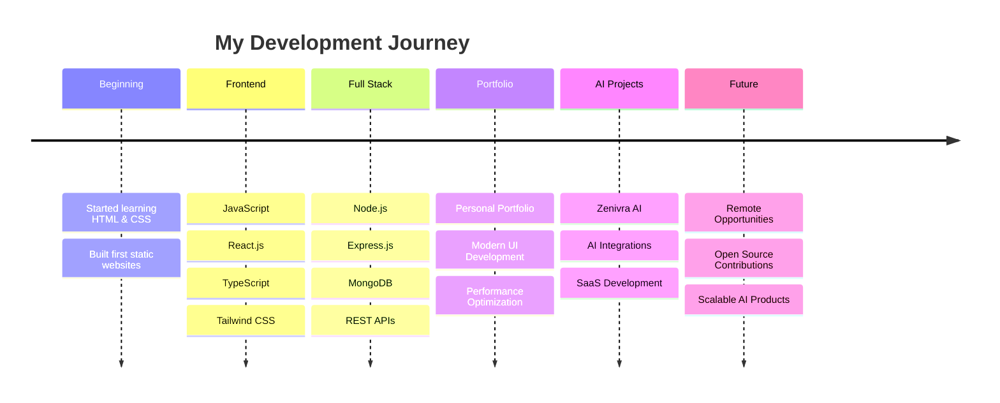

<div align="center">

# 🚀 Mohmad Naved

### Full Stack Developer • MERN Stack • React.js • TypeScript • UI Engineering

<p align="center">
Building modern, responsive, and scalable web applications with a strong focus on user experience, clean architecture, and performance.
</p>

<br>

<a href="https://devnaved.dev">

</a>

<a href="https://github.com/naved574/My-Portfolio">

</a>

<a href="https://www.linkedin.com/in/mohmmad-naved-0475783a3/">

</a>

<a href="mailto:naved.ansari0003@gmail.com">

</a>

<br><br>



<br><br>


<br><br>


</div>

---

# 👋 Welcome

Welcome to my personal portfolio repository.

This project is a modern developer portfolio designed to showcase my technical skills, featured projects, and approach to building high-quality web applications.

Rather than creating a traditional portfolio, I wanted to build an experience that reflects the same engineering principles I apply while developing real-world software: clean architecture, responsive design, maintainable code, smooth interactions, and attention to detail.

Whether you're a recruiter, developer, client, or fellow learner, this repository provides an overview of my work, technical capabilities, and development journey.

---

# 💡 Why This Portfolio?

A portfolio should demonstrate more than screenshots—it should reflect how a developer thinks, designs, and builds.

This portfolio focuses on:

- Building production-quality user interfaces
- Writing clean and maintainable code
- Creating responsive experiences for every device
- Applying modern frontend best practices
- Presenting projects with clarity and professionalism
- Demonstrating continuous learning through real projects

---

# ✨ Highlights

- 🚀 Premium modern UI
- ⚛️ Built with React + TypeScript
- ⚡ Powered by Vite
- 🎨 Tailwind CSS design system
- 🎬 Smooth animations with Framer Motion & GSAP
- 📱 Fully responsive across all devices
- 💼 Professional project showcase
- 🧩 Modular component architecture
- 🌙 Optimized dark mode experience
- 📈 Continuously updated with new work

---

# 🎯 Portfolio Goals

The primary objective of this portfolio is to present both technical ability and problem-solving skills through real-world projects.

It serves as a central place where visitors can:

- Explore featured applications
- Learn about my technical stack
- View development experience
- Review project architecture
- Access live demos and source code
- Contact me for collaboration or opportunities

---


# 📚 Table of Contents

- Overview
- Features
- Portfolio Preview
- Tech Stack
- Featured Projects
- Skills
- Architecture
- Folder Structure
- Installation
- Performance
- Future Plans
- Contact
- License

---

# ⚡ Quick Links

| Resource | Link |
|----------|------|
| 🌐 Live Portfolio | https://devnaved.dev/ |
| 💻 GitHub Repository | https://github.com/naved574/My-Portfolio |
| 📄 Resume | https://devnaved.dev/resume.pdf |
| 💼 LinkedIn | https://www.linkedin.com/in/mohmmad-naved-0475783a3/ |
| 📧 Email | naved.ansari0003@gmail.com |

---

# 🌟 What You'll Find Here

This repository includes everything needed to understand my work and development approach.

- Modern portfolio application
- Featured project showcase
- Professional UI/UX implementation
- Responsive design system
- Production-ready code structure
- Clean component organization
- Performance-focused development
- Scalable frontend architecture

---


# 🛠️ Tech Stack

This portfolio is built using a modern frontend ecosystem that prioritizes performance, scalability, maintainability, and developer experience.

## Frontend

| Technology | Purpose |
|------------|---------|
| ⚛️ React | Component-based UI development |
| 🟦 TypeScript | Type-safe application development |
| ⚡ Vite | Fast development & optimized production builds |
| 🎨 Tailwind CSS | Utility-first styling system |
| 🎬 Framer Motion | Smooth UI animations |
| ✨ GSAP | Advanced interactive animations |
| 🎯 Lucide React | Modern icon system |

---

## Backend Knowledge

Although this portfolio is frontend-focused, my full stack development experience includes:

| Technology | Purpose |
|------------|---------|
| 🟢 Node.js | Runtime Environment |
| 🚂 Express.js | REST API Development |
| 🍃 MongoDB | NoSQL Database |
| 🧩 Mongoose | MongoDB ODM |
| 🔐 JWT | Authentication |
| 🔑 bcrypt | Password Security |

---

# 🚀 Featured Projects

## 🎨 Zenivra AI

A premium AI-powered image generation platform inspired by modern SaaS products.

### Highlights

- AI Image Generation
- Premium UI/UX
- Responsive Design
- Dark Mode
- Framer Motion Animations
- GSAP Effects
- Modular Architecture
- Hugging Face Integration

**Tech Stack**

React • TypeScript • Tailwind CSS • Vite • Framer Motion • GSAP

---

## 💼 Portfolio Website

This repository itself is one of my primary projects.

Its objective is to demonstrate:

- UI Engineering
- Component Architecture
- Responsive Development
- Animation Systems
- Performance Optimization
- Modern Frontend Practices

---

# 🧠 Technical Skills

## Frontend

- React.js
- JavaScript (ES6+)
- TypeScript
- HTML5
- CSS3
- Tailwind CSS
- Responsive Design
- Framer Motion
- GSAP

---

## Backend

- Node.js
- Express.js
- MongoDB
- REST APIs
- Authentication
- JWT
- Mongoose

---

## Tools

- Git
- GitHub
- Vercel
- VS Code
- Postman
- Figma
- npm

---

# 🏗️ Portfolio Architecture



---

# 📂 Project Structure

```text
Portfolio/
│
├── backend/
│
├── frontend/
│
└── README.md
```

---

# 🚀 Getting Started

Clone the repository.

```bash
git clone https://github.com/naved574/My-Portfolio.git
```

Move into the project directory.

```bash
cd My-Portfolio
```

Install dependencies.

```bash
npm install
```

Start the development server.

```bash
npm run dev
```

Build for production.

```bash
npm run build
```

Preview the production build.

```bash
npm run preview
```

---


# 📱 Responsive Design

Designed for a consistent experience across every device.

- 💻 Desktop
- 💼 Laptop
- 📱 Mobile
- 📟 Tablet
- 🖥️ Large Displays

---

# ⚡ Performance

This portfolio is optimized using modern frontend techniques.

- Fast Vite builds
- Optimized asset loading
- Code splitting
- Lazy loading
- Responsive image rendering
- Smooth animations
- Minimal bundle size
- Reusable component architecture

---

# 🎨 Design Philosophy

Every design decision follows a simple principle:

> **Minimal aesthetics, maximum clarity.**

The portfolio emphasizes:

- Clean layouts
- Strong typography
- Consistent spacing
- Smooth interactions
- Accessible components
- Scalable architecture
- Modern SaaS-inspired design language

---

# 📈 Future Improvements

The portfolio will continue evolving with new features.

### Planned

- Developer Blog
- Interactive Case Studies
- Project Detail Pages
- Experience Timeline
- Resume Download
- Contact Form Backend
- SEO Improvements
- Open Graph Images
- Performance Monitoring
- Analytics Dashboard

---

---

# 👨‍💻 About Me

Hi, I'm **Mohmad Naved**, a passionate Full Stack Developer who enjoys transforming ideas into modern, responsive, and production-quality web applications.

My primary focus is building applications that combine clean architecture, excellent user experience, and scalable engineering practices.

I believe great software isn't only about writing code—it's about solving problems, creating intuitive experiences, and continuously improving through learning and experimentation.

---

# 🚀 My Development Philosophy

Every project I build follows a few simple principles:

- Build with purpose
- Write clean and maintainable code
- Design for real users
- Prioritize performance
- Keep learning continuously
- Never stop improving

> **"Great products are built through consistency, attention to detail, and continuous learning."**

---

# 💼 Career Objective

My goal is to become a professional Full Stack Engineer working on products that impact thousands of users.

I'm especially interested in:

- Modern Frontend Engineering
- SaaS Applications
- AI-powered Products
- Developer Tools
- Performance Optimization
- Product Design
- Scalable Web Architecture

---

# 🌱 Currently Learning

I'm continuously expanding my knowledge in modern web development.

Current areas of focus include:

- Advanced React Patterns
- Next.js
- System Design
- Data Structures & Algorithms
- Backend Architecture
- Authentication Systems
- Performance Optimization
- AI Application Development
- Cloud Deployment

---

# 🗺️ Developer Journey



---

# 🏆 Featured Strengths

- Clean Code Practices
- Component-Based Architecture
- Responsive UI Development
- Strong Problem Solving
- Modern JavaScript & TypeScript
- Fast Learning Ability
- UI/UX Attention to Detail
- Scalable Project Structure
- Continuous Improvement Mindset

---

# 📚 Learning Mindset

Technology evolves rapidly, and I believe continuous learning is one of the most important qualities of a software engineer.

I actively explore new technologies, improve existing projects, and practice modern development techniques to become a better engineer every day.

---

# 🤝 Open Source

I enjoy learning from the open-source community and hope to contribute more as I continue growing as a developer.

Feedback, suggestions, and discussions are always welcome.

---

# 📬 Let's Connect

If you'd like to collaborate, discuss opportunities, or simply connect, feel free to reach out.

| Platform | Link |
|----------|------|
| 🌐 Portfolio | https://devnaved.dev |
| 💻 GitHub | https://github.com/naved574 |
| 💼 LinkedIn | https://www.linkedin.com/in/mohmmad-naved-0475783a3/ |
| 📧 Email | naved.ansari0003@gmail.com |

---

# 📄 Resume

You can download my latest resume from my portfolio website or contact me directly for the most up-to-date version.

---

# 🤝 Contributing

This is a personal portfolio project.

While external contributions aren't expected, suggestions, bug reports, and constructive feedback are always appreciated.

If you notice an issue or have an idea for improvement, feel free to open an Issue.

---

# 🙏 Acknowledgements

This portfolio wouldn't be possible without the amazing open-source community.

Special thanks to:

- React
- Vite
- TypeScript
- Tailwind CSS
- Framer Motion
- GSAP
- Node.js
- Express.js
- MongoDB
- GitHub
- Vercel

---

# 📄 License

This project is licensed under the **MIT License**.

Feel free to explore the code, learn from it, and use it as inspiration for your own projects.

---

# ⭐ Support

If you found this project helpful or inspiring:

- ⭐ Star the repository
- 🍴 Fork the project
- 📢 Share it with others
- 💬 Leave feedback
- 🤝 Connect with me

Every bit of support motivates me to continue building and learning.

---

<div align="center">

# 🚀 Thank You for Visiting

### Thanks for taking the time to explore my portfolio.

I'm always excited to connect with developers, recruiters, and creators who enjoy building meaningful digital experiences.

<br>

### Let's build something amazing together.

<br>

Made with ❤️ by **Mohmad Naved**

© 2026 Mohmad Naved. All Rights Reserved.

</div>